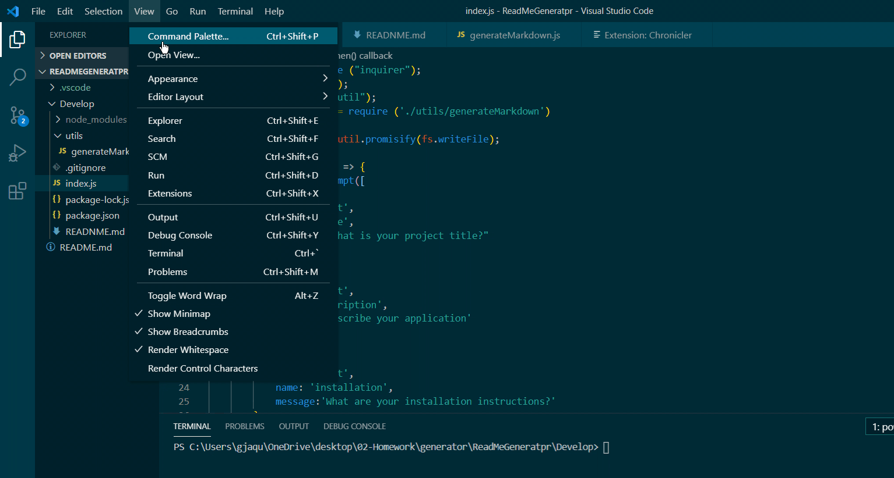

# Generator Homework
  This application generates a read me through the command line.

  #### TABLE OF CONTENTS 
  * [Installation](#Installation)
  * [Usage](#Usage)
  * [Contribution](#Contribution)
  * [Test](#Test)
  * [License](#License)
  * [GitHub](#GitHub)
  * [Contact](#Contact)
  * [Recording](#Recording)

  ## Installation
  npm i inquirer

  ## Usage Information
   This application is used to create read me for repos.

  ## Contribution 
  Create a unique branch and create a pull request. 

  ## How to Test 
  Run on your local device to test. 

  ## License 
  MIT

  ## GitHub Username 
  @buildGa;

  ## Contact Me 
  Email: [gjaquelin7@outlook.com]

  ## Recording
  

